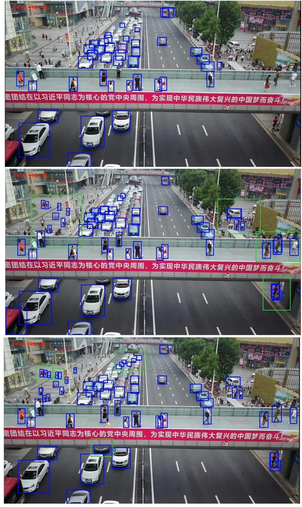

This is an implementation of ["M. Aktaş and H. F. Ateş, "Small Object Detection and Tracking from Aerial Imagery,"](https://ieeexplore.ieee.org/document/9558923) 2021 6th International Conference on Computer Science and Engineering (UBMK), 2021, pp. 688-693, doi: 10.1109/UBMK52708.2021.9558923"

<div align="center">
  
</div>

This repository is the official implementation of "...". Faster-RCNN :heart:

## License

Detectron2 is released under the [Apache 2.0 license](LICENSE).

## Citing Detectron2

If you use Detectron2 in your research or wish to refer to the baseline results published in the [Model Zoo](MODEL_ZOO.md), please use the following BibTeX entry.

```BibTeX
@misc{wu2019detectron2,
  author =       {Yuxin Wu and Alexander Kirillov and Francisco Massa and
                  Wan-Yen Lo and Ross Girshick},
  title =        {Detectron2},
  howpublished = {\url{https://github.com/facebookresearch/detectron2}},
  year =         {2019}
}
```
